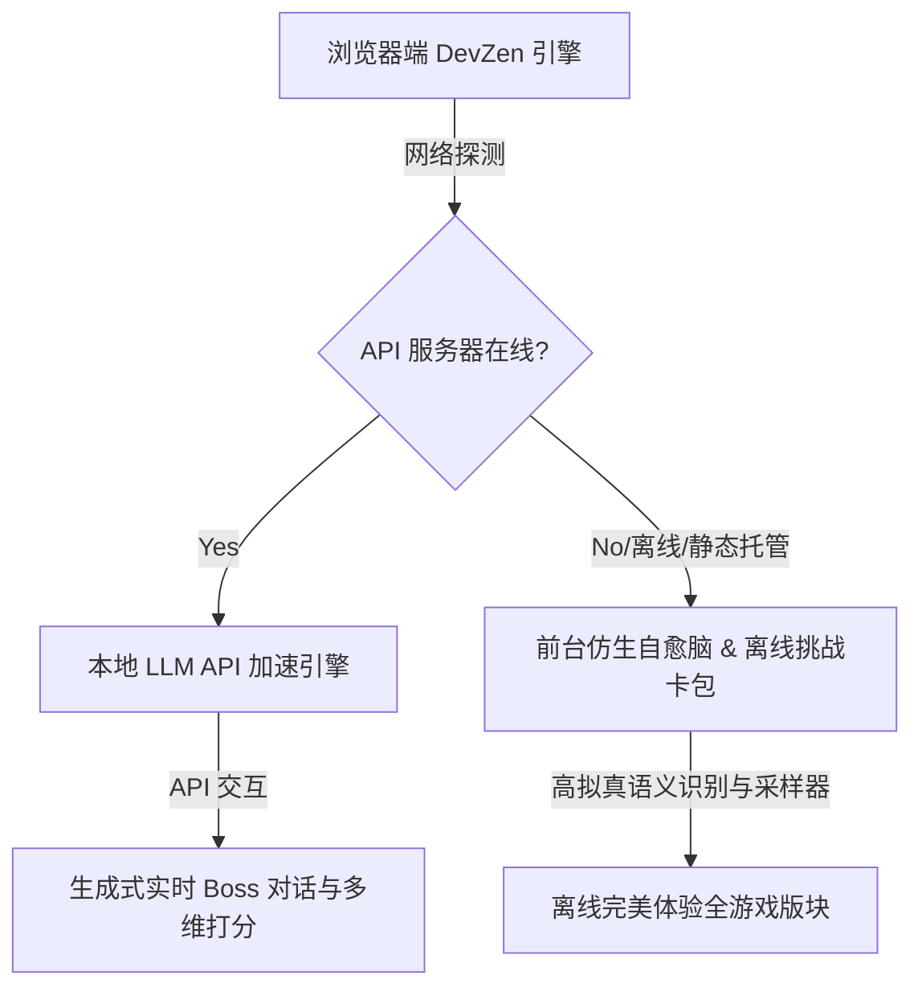

# 🌌 DevZen (极客修仙)
> **大厂研发架构抉择与分布式故障侦探沙盒游戏**

[]()
[]()
[]()

`DevZen` 是一款专为**软件工程师、系统架构师与技术 Lead**量身定制的沉浸式职场模拟与架构沙盒游戏。在 AI 时代，技术品味与商业对齐同样重要。在这里，你将化身核心架构师，经历线上洪峰、分布式灾难，并在技术博弈与商业人情中“渡劫修仙”。

---

## 🌟 核心玩法三大版块

### 🔮 1. 混沌侦探室 (Chaos Detective) —— 疑难杂症，法眼追凶
你将面对极其逼真的线上真实故障现场（涵盖 Java 并发死锁、Go 协程泄漏、Python 内存抖动等经典生产灾难）。
*   **仿真终端交互**：输入 `cat`、`jstack`、`grep`、`top` 等指令排查真实系统日志。
*   **多语言真实还原**：专为 Java/Go/Python 深度定制，还原异常调用栈与死锁链路。
*   **灵性推理注入**：找出幕后真凶（如 unbuffered channel 阻塞、Redis 缓存雪崩、双重检查加锁漏洞），积累系统修为！

### 📊 2. 架构天平模拟器 (Architecture Telemetry Sandbox) —— 60FPS 实时流体观测
在 60FPS 硬件加速的 SVG Telemetry 实时大盘中，亲手操控系统核心组件，做出生死抉择。
*   **三大并发高难度场景**：
    1.  *大促秒杀结算抉择* (AP vs CP, 悲观锁 vs 旁路缓存, 异步队列落库削峰)
    2.  *海量日志实时计算大盘* (聚合窗口大小博弈, Flink 状态大小调优, 动态背压缓冲)
    3.  *高并发社交 Feed 流* (读扩散 Pull vs 写扩散 Push, HBase 冷热隔离, 动态滑动窗口缓存)
*   **动态遥测大盘**：实时渲染吞吐量 (TPS)、延迟 (Latency)、错误率 (Error Rate) 与云资源机器成本 (Cost)。
*   **可视化流控拓扑**：点击拓扑节点一键开关 Kafka 削峰、Redis 分流或多实例扩容，亲眼观测波形平滑演进。

### 👨‍💼 3. 职场对齐大师 (Boss Alignment Simulator) —— 商业对齐与生存博弈
面对不懂技术、只看 KPI 与预算的**业务线总经理「李总」**，你该如何兜售你的技术方案？
*   **卡牌抉择模式**：在 3 大职场经典冲突（高并发重构、技术债偿还、微服务收缩合并）中做抉择。学会用「帮业务省钱」、「缩短交付排期」的商业语言做技术向上管理。
*   **生成式 AI 对齐模式 (LLM Enabled)**：开启本地服务器后，可进行**自由文本汇报**。李总将利用生成式仿生脑严苛审阅你的方案，稍有不慎便会大发雷霆甚至将你“优化”！

---

## 🛠️ 极客架构：自愈型 Serverless 引擎
`DevZen` 采用了前沿的**零服务器成本 (Zero Server Cost) 静态自愈架构**，不仅保证了极高的可玩性，还做到了极易分发：



*   **完全静态 PWA 支持**：开箱即用，支持完全离线运行、支持安装到手机/桌面端，首屏加载小于 1 秒。
*   **智能降级机制**：在 GitHub Pages 等静态托管环境运行时，如果无法连接本地 Python API 服务器，游戏会自动激活**前台自愈仿生脑**。通过前台的智能分词与词权匹配矩阵，完美降级提供本地 Boss 对抗及挑战关卡。

---

## 🚀 快速开始

### 方式 A：免安装·直接体验 (零服务器依赖)
1.  双击直接在浏览器中打开项目根目录下的 [index.html](index.html)。
2.  或者通过任一静态 Web 服务启动（如 `python3 -m http.server 8000`）。
3.  点击浏览器地址栏的“安装”图标，一键将 `DevZen` 添加至你的系统应用图标中，随时 offline 畅享。

### 方式 B：开发者模式·开启生成式 AI 仿生脑
若要解锁**自由汇报文本输入**并由本地 LLM 实时诊断反馈：
1.  **启动 API 服务器**：
    ```bash
    python3 toolchain/server.py
    ```
2.  **配置 LLM API**：
    编辑 `toolchain/llm_compiler.py`，配置您的本地大模型服务或云端 API KEY（如 Gemini / OpenAI / DeepSeek / Ollama）。
3.  在游戏第三版块切换模式为 **“生成式 AI 对齐模式”**，即可开始与李总展开充满博弈的文字大乱斗！

---

## 🗺️ 演进路线 (Roadmap)
*   [x] 混沌侦探室多语言扩展（Java, Python, Go）
*   [x] 60FPS SVG 遥测拓扑与动态扩缩容公式
*   [x] Serverless 自愈与 PWA 离线卡包离线化
*   [ ] 社区共建：支持开发者以标准 JSON 格式贡献自定义“故障案例”与“职场抉择”关卡卡包
*   [ ] Reigns (王权) 风格的研发总监生存卡牌模式
*   [ ] 全局排行榜与开发团队联机“对账/撕扯”模式

---

## 🤝 贡献与共建
我们热烈欢迎各类技术人、架构师贡献脑洞！
*   如果你遇到了极其经典的线上线上 Bug，欢迎在 `detective-cases` 中贡献你的排错日志与分析逻辑。
*   如果你在职场遇到了让人啼笑皆非的“技术与商业对齐”博弈，欢迎在 `boss-dialogs` 中添加你的段子。

**在代码里修仙，在架构里飞升，祝你早日证得你的“技术道果”！🌌**
